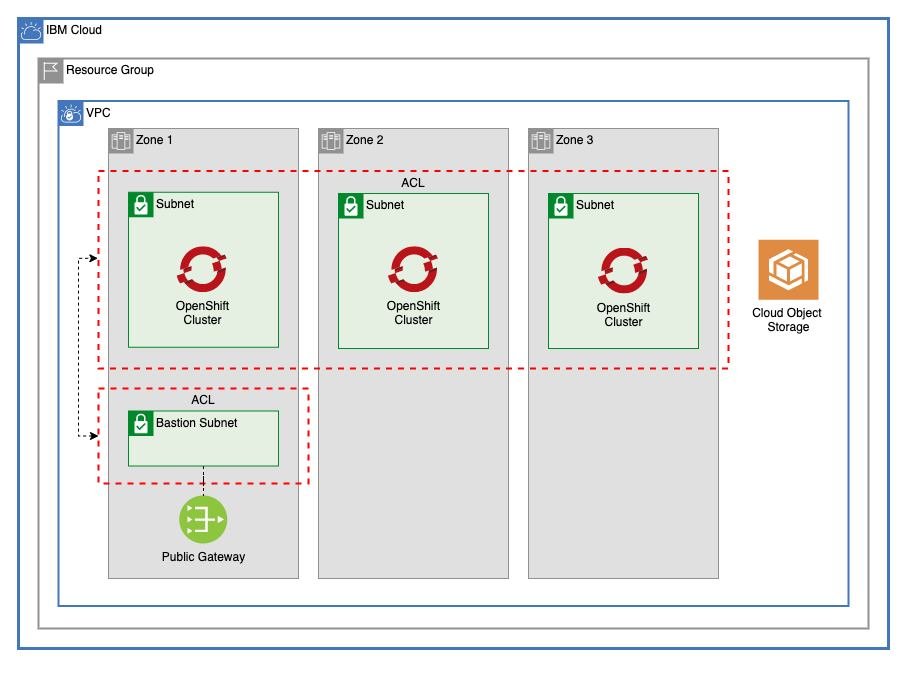

# GCAT Multizone VPC With Bastion Subnet

This module uses the [gcat-multitier-vpc](https://github.com/Cloud-Schematics/gcat-multitier-vpc) as a template to create a multizone VPC with a Red Hat OpenShift cluster, and a bastion subnet



---

## Table of Contents

1. [VPC](##vpc)
2. [Public Gateways](##public-gateways)
3. [Network ACLs](##network-acl)
   - [Dynamic Network Connection Rules](###dynamic-network-connection-rules)
   - [Cluster ACL Rules](###cluster-acl-rules)
   - [Default VPC ACL Rules](###Default-VPC-ACL-Rules)
   - [Default Bastion ACL Rules](###Default-VPC-ACL-Rules)
4. [Subnet Tiers](##subnet-tiers)
5. [Cloud Object Storage](##cloud-object-storage)
6. [Red Hat OpenShift Cluster](##Red-Hat-OpenShift-Cluster)
7. [Module Variables](##Module-Variables)
8. [Module Outputs](##Module-Outputs)
9. [As A Module in a Larger Architecture](##As-A-Module-in-a-Larger-Architecture)

---

## VPC

This module creates a VPC in a resource group with optional Classic Access. It also allows users to update the default vpc security group with additional rules.

### Default Security Group Rules

Default security group rules are converted from a list to an object to ensure that adding, deleting, or changing the order of rules listed will not force unwanted changes. Example:

```terraform
ibm_is_security_group_rule.default_vpc_rule["allow-inbound-ping"]
ibm_is_security_group_rule.default_vpc_rule["allow-inbound-ssh"]
```

---

## Public Gateways

This module allows a user to optionally create public gateways in the VPC in each of the three zones of the VPC's region. Be default, one is only created in Zone 1. Example addresses when creating all three gateways:

```terraform
ibm_is_public_gateway.gateway["zone-1"]
ibm_is_public_gateway.gateway["zone-2"]
ibm_is_public_gateway.gateway["zone-3"]
```

---

## Network ACLs

This module by default creates two network ACLs, one for the VPC tier, and one for the Bastion Subnet. 

### Dynamic Network Connection Rules

Each ACL object in the `network_acls` variable can use a field called `network_connections`. By entering the names of other tiers, this will dynamically generate rules that will allow both inbound and outbound traffic for CIDR blocks in that other tier. These rules are created in [network_acl.tf](network_acl.tf) and are applied *before* any additional rules in each variable

Each ACL can also accept the boolean field `add_cluster_rules`. This will automatically add ACL rules to allow for an OpenShift Cluster to be provisioned on the subnets.

### Cluster ACL Rules

These rules are added to the VPC ACL by default, since `add_cluster_rules` is `true`.

Direction | Rule                                                          | Allow / Deny | Protocol | Source         | Source Port   | Destination   | Desination Port
----------|---------------------------------------------------------------|--------------|----------|----------------|---------------|---------------|-----------------
Inbound   | Allow Worker Nodes to be Created                              | Allow        | All      | 161.26.0.0/16  | -             | 0.0.0.0/0     | -
Inbound   | Allow communication to Services over Private Service Endpoint | Allow        | All      | 166.8.0.0/14   | -             | 0.0.0.0/0     | -
Inbound   | Allow incoming traffic requests to apps on worker nodes       | Allow        | TCP      | 0.0.0.0/0      | 30000 - 32767 | 0.0.0.0/0     | -
Inbound   | Allow load balancer and ingress app incoming traffic          | Allow        | TCP      | 0.0.0.0/0      | Any           | 0.0.0.0/0     | 443
Outbound  | Allow Worker Nodes to be Created                              | Allow        | All      | 0.0.0.0/0      | -             | 161.26.0.0/16 | -
Outbound  | Allow communication to Services over Private Service Endpoint | Allow        | All      | 0.0.0.0/0      | -             | 166.8.0.0/14  | -
Outbound  | Allow incoming traffic requests to apps on worker nodes       | Allow        | TCP      | 0.0.0.0/0      | 30000 - 32767 | 0.0.0.0/0     | -
Outbound  | Allow load balancer and ingress app incoming traffic          | Allow        | TCP      | 0.0.0.0/0      | Any           | 0.0.0.0/0     | 443

### Default VPC ACL Rules

Direction | Allow / Deny | Protocol | Source         | Source Port   | Destination    | Desination Port
----------|--------------|----------|----------------|---------------|----------------|---------
Inbound   | Allow        | All      | 10.40.10.0/24  | -             | 0.0.0.0/0      | -
Outbound  | Allow        | All      | 0.0.0.0/0      | -             | 10.40.10.0/24  | -
Inbound   | Deny         | All      | 0.0.0.0/0      | -             | 0.0.0.0/0      | -
Outbound  | Deny         | All      | 0.0.0.0/0      | -             | 0.0.0.0/0      | -

### Default Bastion ACL Rules

Direction | Allow / Deny | Protocol | Source         | Source Port   | Destination    | Desination Port
----------|--------------|----------|----------------|---------------|----------------|---------
Inbound   | Allow        | All      | 10.10.10.0/24  | -             | 0.0.0.0/0      | -
Inbound   | Allow        | All      | 10.20.10.0/24  | -             | 0.0.0.0/0      | -
Inbound   | Allow        | All      | 10.30.10.0/24  | -             | 0.0.0.0/0      | -
Outbound  | Allow        | All      | 0.0.0.0/0      | -             | 10.10.10.0/24  | -
Outbound  | Allow        | All      | 0.0.0.0/0      | -             | 10.20.10.0/24  | -
Outbound  | Allow        | All      | 0.0.0.0/0      | -             | 10.30.10.0/24  | -
Inbound   | Allow        | All      | 0.0.0.0/0      | -             | 0.0.0.0/0      | -
Outbound  | Allow        | All      | 0.0.0.0/0      | -             | 0.0.0.0/0      | -

## Subnet Tiers

This module allows users to create subnets across any number of tiers across 1, 2, or 3 zones. Each tier can have any number of subnets. The default for this module creates three tiers, each with one subnet in each zone.

For the `acl_name` field, use only names of ACLs defined in the `network_acls` variables.

The type of the `subnet_tiers` variable is as follows:

```terraform
list(
    object({
      name     = string
      acl_name = string
      subnets  = object({
        zone-1 = list(
          object({
            name           = string
            cidr           = string
            public_gateway = optional(bool)
          })
        )
        zone-2 = list(
          object({
            name           = string
            cidr           = string
            public_gateway = optional(bool)
          })
        )
        zone-3 = list(
          object({
            name           = string
            cidr           = string
            public_gateway = optional(bool)
          })
        )
      })
    })
  )
```

***Note:** To allow for a tier to be created for the Bastion subnet, this type has been commented out in [variables.tf](variables.tf). Validation checks are still run against these variables for validation.*

Dynamic addresses are created for each subnet by name to ensure that modifying these lists will not result in unexpected changes to your existing infrastructure:

```terraform
module.subnets.ibm_is_subnet.subnet["gcat-bastion-subnet-a"]
module.subnets.ibm_is_subnet.subnet["gcat-vpc-subnet-a"]
module.subnets.ibm_is_subnet.subnet["gcat-vpc-subnet-b"]
module.subnets.ibm_is_subnet.subnet["gcat-vpc-subnet-c"]
module.subnets.ibm_is_vpc_address_prefix.subnet_prefix["gcat-bastion-subnet-a"]
module.subnets.ibm_is_vpc_address_prefix.subnet_prefix["gcat-vpc-subnet-a"]
module.subnets.ibm_is_vpc_address_prefix.subnet_prefix["gcat-vpc-subnet-b"]
module.subnets.ibm_is_vpc_address_prefix.subnet_prefix["gcat-vpc-subnet-c"]
```

### Address Prefixes

A CIDR block is created in the VPC for each subnet that will be provisioned

---

## Cloud Object Storage

This module creates an IBM Cloud Object Stroage instance required for the creation of an OpenShift cluster. 

---

## Red Hat OpenShift Cluster

This module creates a Red Hat OpenShift Cluster across all the subnets created for the [VPC](##VPC). This module can also dynamically create additional worker pools across the subnets.

The cluster resources can be found in the [cluster](/cluster) folder.

---

## Module Variables

Name                 | Type                                                                                                                                                                                                                                                                                                                                                                                                                                                                                                                                                                                                                                       | Description                                                                                                                                                                                                                                                                                                                                                                                                                                                                         | Sensitive | Default
-------------------- | ------------------------------------------------------------------------------------------------------------------------------------------------------------------------------------------------------------------------------------------------------------------------------------------------------------------------------------------------------------------------------------------------------------------------------------------------------------------------------------------------------------------------------------------------------------------------------------------------------------------------------------------ | ----------------------------------------------------------------------------------------------------------------------------------------------------------------------------------------------------------------------------------------------------------------------------------------------------------------------------------------------------------------------------------------------------------------------------------------------------------------------------------- | --------- | ---------------------------------------------------------------------------------------------------------------------------------------------------------------------------------------------------------------------------------------------------------------------------------------------------------------------------------------------------------------------------------------------------------------------------------------------------------------------------------------------------------------------------------------------------------------------------------------------------------------------------------------------------------------------------------------------------------------------------------------------------------------------------------------
ibmcloud_api_key     | string                                                                                                                                                                                                                                                                                                                                                                                                                                                                                                                                                                                                                                     | The IBM Cloud platform API key needed to deploy IAM enabled resources                                                                                                                                                                                                                                                                                                                                                                                                               | true      | 
TF_VERSION           | string                                                                                                                                                                                                                                                                                                                                                                                                                                                                                                                                                                                                                                     | The version of the Terraform engine that's used in the Schematics workspace.                                                                                                                                                                                                                                                                                                                                                                                                        |           | 1.0
prefix               | string                                                                                                                                                                                                                                                                                                                                                                                                                                                                                                                                                                                                                                     | A unique identifier need to provision resources. Must begin with a letter                                                                                                                                                                                                                                                                                                                                                                                                           |           | gcat-multizone
region               | string                                                                                                                                                                                                                                                                                                                                                                                                                                                                                                                                                                                                                                     | Region where VPC will be created                                                                                                                                                                                                                                                                                                                                                                                                                                                    |           | us-south
resource_group       | string                                                                                                                                                                                                                                                                                                                                                                                                                                                                                                                                                                                                                                     | Name of resource group where all infrastructure will be provisioned                                                                                                                                                                                                                                                                                                                                                                                                                 |           | asset-development
classic_access       | bool                                                                                                                                                                                                                                                                                                                                                                                                                                                                                                                                                                                                                                       | Enable VPC Classic Access. Note: only one VPC per region can have classic access                                                                                                                                                                                                                                                                                                                                                                                                    |           | false
subnet_tiers         |                                                                                                                                                                                                                                                                                                                                                                                                                                                                                                                                                                                                                                            | List of subnets tiers for the vpc.                                                                                                                                                                                                                                                                                                                                                                                                                                                  |           | [<br>{<br>name = "vpc"<br>acl_name = "vpc-acl"<br>subnets = {<br>zone-1 = [<br>{<br>name = "subnet-a"<br>cidr = "10.10.10.0/24"<br>public_gateway = true<br>}<br>],<br>zone-2 = [<br>{<br>name = "subnet-b"<br>cidr = "10.20.10.0/24"<br>public_gateway = true<br>}<br>],<br>zone-3 = [<br>{<br>name = "subnet-c"<br>cidr = "10.30.10.0/24"<br>public_gateway = true<br>}<br>]<br>}<br>},<br>{<br>name = "bastion"<br>acl_name = "bastion-acl"<br>subnets = {<br>zone-1 = [<br>{<br>name = "subnet-a"<br>cidr = "10.40.10.0/24"<br>public_gateway = false<br>}<br>]<br>zone-2 = []<br>zone-3 = []<br>}<br>]
use_public_gateways  | object({ zone-1 = optional(bool) zone-2 = optional(bool) zone-3 = optional(bool) })                                                                                                                                                                                                                                                                                                                                                                                                                                                                                                                                                        | Create a public gateway in any of the three zones with `true`.                                                                                                                                                                                                                                                                                                                                                                                                                      |           | {<br>zone-1 = true<br>zone-2 = false<br>zone-3 = false<br>}
network_acls         | list( object({ name = string network_connections = optional(list(string)) add_cluster_rules = optional(bool) rules = list( object({ name = string action = string destination = string direction = string source = string tcp = optional( object({ port_max = optional(number) port_min = optional(number) source_port_max = optional(number) source_port_min = optional(number) }) ) udp = optional( object({ port_max = optional(number) port_min = optional(number) source_port_max = optional(number) source_port_min = optional(number) }) ) icmp = optional( object({ type = optional(number) code = optional(number) }) ) }) ) }) ) | List of ACLs to create. Rules can be automatically created to allow inbound and outbound traffic from a VPC tier by adding the name of that tier to the `network_connections` list. Rules automatically generated by these network connections will be added at the beginning of a list, and will be web-tierlied to traffic first. At least one rule must be provided for each ACL.                                                                                                |           | [<br>{<br>name = "vpc-acl"<br>network_connections = ["bastion"]<br>add_cluster_rules = true<br>rules = [<br>{<br>name = "deny-all-inbound"<br>action = "deny"<br>direction = "inbound"<br>destination = "0.0.0.0/0"<br>source = "0.0.0.0/0"<br>},<br>{<br>name = "deny-all-outbound"<br>action = "deny"<br>direction = "outbound"<br>destination = "0.0.0.0/0"<br>source = "0.0.0.0/0"<br>}<br>]<br>},<br>{<br>name = "bastion-acl"<br>network_connections = ["vpc"]<br>rules = [<br>{<br>name = "allow-all-inbound"<br>action = "allow"<br>direction = "inbound"<br>destination = "0.0.0.0/0"<br>source = "0.0.0.0/0"<br>},<br>{<br>name = "allow-all-outbound"<br>action = "allow"<br>direction = "outbound"<br>destination = "0.0.0.0/0"<br>source = "0.0.0.0/0"<br>}<br>]<br>}<br>]
security_group_rules | list( object({ name = string direction = string remote = string tcp = optional( object({ port_max = optional(number) port_min = optional(number) }) ) udp = optional( object({ port_max = optional(number) port_min = optional(number) }) ) icmp = optional( object({ type = optional(number) code = optional(number) }) ) }) )                                                                                                                                                                                                                                                                                                            | A list of security group rules to be added to the default vpc security group                                                                                                                                                                                                                                                                                                                                                                                                        |           | [<br>{<br>name = "allow-inbound-ping"<br>direction = "inbound"<br>remote = "0.0.0.0/0"<br>icmp = {<br>type = 8<br>}<br>},<br>{<br>name = "allow-inbound-ssh"<br>direction = "inbound"<br>remote = "0.0.0.0/0"<br>tcp = {<br>port_min = 22<br>port_max = 22<br>}<br>},<br>]
machine_type         | string                                                                                                                                                                                                                                                                                                                                                                                                                                                                                                                                                                                                                                     | The flavor of VPC worker node to use for your cluster. Use `ibmcloud ks flavors` to find flavors for a region.                                                                                                                                                                                                                                                                                                                                                                      |           | bx2.4x16
workers_per_zone     | number                                                                                                                                                                                                                                                                                                                                                                                                                                                                                                                                                                                                                                     | Number of workers to provision in each subnet                                                                                                                                                                                                                                                                                                                                                                                                                                       |           | 2
entitlement          | string                                                                                                                                                                                                                                                                                                                                                                                                                                                                                                                                                                                                                                     | If you purchased an IBM Cloud Cloud Pak that includes an entitlement to run worker nodes that are installed with OpenShift Container Platform, enter entitlement to create your cluster with that entitlement so that you are not charged twice for the OpenShift license. Note that this option can be set only when you create the cluster. After the cluster is created, the cost for the OpenShift license occurred and you cannot disable this charge.                         |           | cloud_pak
kube_version         | string                                                                                                                                                                                                                                                                                                                                                                                                                                                                                                                                                                                                                                     | Specify the Kubernetes version, including the major.minor version. To see available versions, run `ibmcloud ks versions`.                                                                                                                                                                                                                                                                                                                                                           |           | 4.7.30_openshift
wait_till            | string                                                                                                                                                                                                                                                                                                                                                                                                                                                                                                                                                                                                                                     | To avoid long wait times when you run your Terraform code, you can specify the stage when you want Terraform to mark the cluster resource creation as completed. Depending on what stage you choose, the cluster creation might not be fully completed and continues to run in the background. However, your Terraform code can continue to run without waiting for the cluster to be fully created. Supported args are `MasterNodeReady`, `OneWorkerNodeReady`, and `IngressReady` |           | IngressReady
tags                 | list(string)                                                                                                                                                                                                                                                                                                                                                                                                                                                                                                                                                                                                                               | A list of tags to add to the cluster                                                                                                                                                                                                                                                                                                                                                                                                                                                |           | []
worker_pools         | list(object({ name = string machine_type = string workers_per_zone = number }))                                                                                                                                                                                                                                                                                                                                                                                                                                                                                                                                                            | List of maps describing worker pools                                                                                                                                                                                                                                                                                                                                                                                                                                                |           | [<br>{<br>name = "dev"<br>machine_type = "cx2.8x16"<br>workers_per_zone = 2<br>},<br>{<br>name = "test"<br>machine_type = "mx2.4x32"<br>workers_per_zone = 2<br>}<br>]

---

## Module Outputs

Name                                  | Description
------------------------------------- | ------------------------------------------------------------------------------
vpc_id                                | ID of VPC created
acls                                  | ID of ACL created for subnets
public_gateways                       | Public gateways created
subnet_ids                            | The IDs of the subnets
subnet_detail_list                    | A list of subnets containing names, CIDR blocks, and zones.
subnet_zone_list                      | A list containing subnet IDs and subnet zones
subnet_tier_list                      | An object containing tiers, each key containing a list of subnets in that tier
cluster_id                            | ID of cluster created
cluster_name                          | Name of cluster created
cluster_private_service_endpoint_url  | URL For Cluster Private Service Endpoint
cluster_private_service_endpoint_port | Port for Cluster private service endpoint

---

## As a Module in a Larger Architecture

Be sure to remove the `provider` block froom [main.tf](./main.tf) before adding to an architecture.

```terraform
module vpc_bastion_cluster {
  source               = "./vpc_bastion_cluster"
  prefix               = var.prefix
  region               = var.region
  resource_group       = var.resource_group
  classic_access       = var.classic_access
  subnet_tiers         = var.subnet_tiers
  use_public_gateways  = var.use_public_gateways
  network_acls         = var.network_acls
  security_group_rules = var.security_group_rules
  machine_type         = var.machine_type
  workers_per_zone     = var.workers_per_zone
  entitlement          = var.entitlement
  kube_version         = var.kube_version
  wait_till            = var.wait_till
  tags                 = var.tags
  worker_pools         = var.worker_pools
}
```